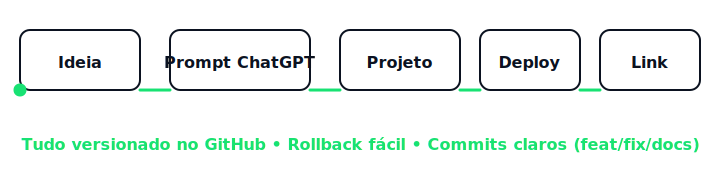
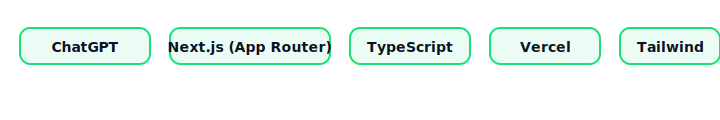

<h1 align="center">👋 Olá, eu sou o <strong>Ivan Monteiro</strong></h1>

💡 Criador de Projetos Web com Inteligência Artificial  
🚀 Construo sites e aplicações reais usando <strong>ChatGPT + GitHub + Vercel</strong>  
🇧🇷 🇵🇹

---

<table>
<tr>
<td width="58%">

### 🧠 Sobre mim
Sou um criador digital que usa **Inteligência Artificial** para transformar ideias em sites reais.  
Trabalho com **ChatGPT + GitHub + Vercel**, organizo tudo com mudanças **incrementais e seguras**, e foco em **clareza, rapidez e utilidade**.

**Atuação principal**
- Planejamento guiado por IA (conteúdo, UX e roadmap)
- Next.js + Vercel com deploy automático
- Projetos em **Finanças**, **Cripto** e **E-commerce**

### ⚙️ Como eu trabalho (pipeline IA)

### 🧩 Tecnologias

</td>
<td width="42%" align="center">

<!-- Apenas o robô, sem título -->

  

</td>
</tr>
</table>

---

### 🚀 Projetos em Destaque

| 🌐 Projeto | Descrição | Link |
|------------|-----------|------|
| **RadarCrypto 2025** | Simulador de trading com 8 pares de cripto, gráfico TradingView e aprendizado sem risco. | [🔗 Acessar projeto](https://radarcrypto.space) |
| **Gerenciamento Familiar** | Controle financeiro pessoal e familiar: entradas/saídas, status e visão mensal clara. | [🔗 Acessar projeto](https://gerenciamentofamiliar.site) |
| **Metas para o Sucesso** | Metas e motivação com acompanhamento de progresso (IA assistida). | _(em breve)_ |
| **SanMon Shop** | Loja demo com catálogo, produto e carrinho. | _(em breve)_ |

---

### 🎯 Objetivo Profissional
Transformar ideias em **sites funcionais e acessíveis**, usando IA e automação para entregar rápido e com qualidade.

### 📬 Contato
📧 **E-mail:** popomonteiro@gmail.com
🌐 **Portfólio:** https://github.com/ivanmonteiro-create
